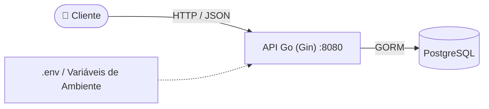
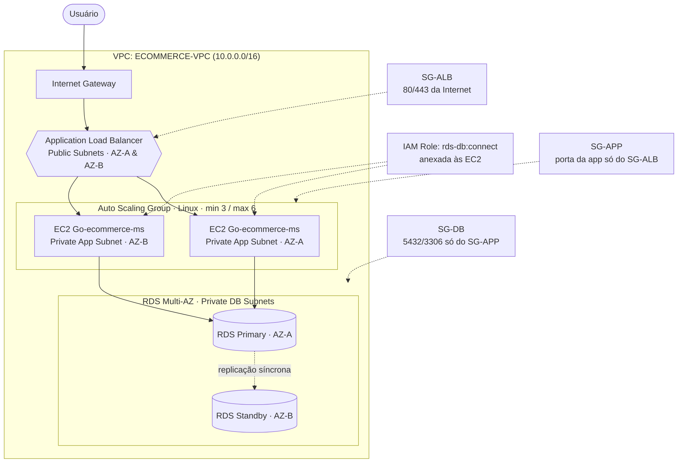

# 🛒 Go E-commerce MS

<p align="center">
  
  
  
  
  
  
</p>

<p align="center">
  
</p>

## 📖 Sobre o projeto

Microsserviço de **gerenciamento de produtos** para um e-commerce, desenvolvido em **Go**, utilizando **Gin** como framework web e **GORM** com **PostgreSQL** para persistência.

Este projeto é o desafio final do bootcamp de **Arquitetura de Soluções**, parte da pós-graduação em **Arquitetura de Software e Soluções em IA** da **XP Educação**. O objetivo é evoluir uma aplicação que hoje roda **on-premises** para uma arquitetura **cloud-ready na AWS**, aplicando na prática conceitos como:

- Build e deploy via containers (Docker / Docker Hub)
- Configuração 100% via variáveis de ambiente (12-factor app)
- Health check dedicado para load balancers
- Alta disponibilidade com banco de dados gerenciado (RDS Multi-AZ)
- Escalabilidade horizontal com Auto Scaling Group atrás de um Application Load Balancer

---

## 🏗️ Arquitetura

### Etapa 1 — On-Premises (atual)



A aplicação roda como um **container único** (`go-ecommerce-ms`), conectado a uma instância PostgreSQL (via `docker-compose`). Toda a configuração — host do banco, credenciais, porta, modo de execução — vem de variáveis de ambiente, sem nada hardcoded no código.

### Etapa 2 — AWS (planejada)



| Componente | Função |
|---|---|
| **Internet Gateway** | Porta de entrada do tráfego da internet para a VPC |
| **Application Load Balancer** | Distribui requisições entre as instâncias EC2, em subnets públicas (AZ-A e AZ-B) |
| **Auto Scaling Group** | Mantém de 3 a 6 instâncias EC2 (Linux) rodando o container `go-ecommerce-ms` em subnets privadas |
| **RDS Multi-AZ (PostgreSQL)** | Instância primária (AZ-A) com standby em réplica síncrona (AZ-B) |
| **Security Groups** | `SG-ALB` (80/443 da internet) → `SG-APP` (porta da app, somente do ALB) → `SG-DB` (5432/3306, somente do SG-APP) |
| **IAM Role** | `rds-db:connect` anexada às instâncias EC2 do Auto Scaling Group |

A mesma imagem Docker publicada no Docker Hub é a que será usada pelas instâncias EC2 do Auto Scaling Group — sem necessidade de rebuild para subir na AWS.

---

## 🛠️ Tecnologias utilizadas

| Camada | Tecnologia |
|---|---|
| Linguagem | Go 1.26 |
| Framework Web | [Gin](https://github.com/gin-gonic/gin) |
| ORM | [GORM](https://gorm.io/) |
| Banco de dados | PostgreSQL 16 |
| Configuração | [godotenv](https://github.com/joho/godotenv) (`.env`) |
| Containerização | Docker (multi-stage build) |
| Cloud (Etapa 2) | AWS — VPC, EC2, Auto Scaling Group, ALB, RDS Multi-AZ, IAM |

---

## 📂 Estrutura do projeto

```
go-ecommerce-ms/
├── assets/
│   └── architecture.png      # Diagrama da arquitetura AWS (Etapa 2)
├── internal/
│   ├── config/                # Inicialização de configs e conexão com o banco
│   ├── dto/
│   │   ├── request/           # DTOs de entrada (ex: ProductRequest)
│   │   └── response/          # DTOs de saída (ex: ProductResponse)
│   ├── handler/                # Handlers HTTP (Gin)
│   ├── model/                  # Entidades do GORM
│   ├── repository/             # Acesso a dados
│   ├── router/                 # Definição das rotas
│   └── service/                # Regras de negócio
├── main.go
├── Dockerfile                  # Build multi-stage (builder + alpine)
├── docker-compose.yml          # PostgreSQL para ambiente local
├── .dockerignore
└── .env
```

---

## 🚀 Como executar localmente

### Pré-requisitos
- [Go 1.26+](https://go.dev/dl/)
- Docker e Docker Compose

### 1. Subir o banco de dados

```bash
docker-compose up -d
```

### 2. Configurar variáveis de ambiente

O arquivo `.env` já vem pronto para o ambiente local:

```env
DB_HOST=localhost
DB_PORT=5432
DB_NAME=go-ecommerce-ms
DB_USER=postgres
DB_PASSWORD=postgres
DB_SSLMODE=disable
PORT=8080
GIN_MODE=release
```

### 3. Rodar a aplicação

```bash
go run main.go
```

A API estará disponível em `http://localhost:8080`.

---

## 📡 Endpoints da API

### Health Check

```
GET /health
```

```json
{ "status": "UP" }
```

### Criar produto

```
POST /api/v1/products/
```

**Body:**
```json
{
  "name": "Notebook",
  "price": 3500.50,
  "stock": 10
}
```

**Resposta `201 Created`:**
```json
{
  "message": "operation from handler : create-product successfull",
  "data": {
    "id": 1,
    "name": "Notebook",
    "price": 3500.50,
    "stock": 10,
    "created_at": "2026-06-09T22:38:14.623Z"
  }
}
```

### Listar produtos

```
GET /api/v1/products/
```

**Resposta `200 OK`:**
```json
{
  "message": "operation from handler : get-products successfull",
  "data": [
    {
      "id": 1,
      "name": "Notebook",
      "price": 3500.50,
      "stock": 10,
      "created_at": "2026-06-09T22:38:14.623Z"
    }
  ]
}
```

---

## 🐳 Docker

### Build da imagem

```bash
docker build -t <seu-usuario>/go-ecommerce-ms:1.0.0 -t <seu-usuario>/go-ecommerce-ms:latest .
```

### Rodar o container localmente

```bash
docker run --rm -p 8080:8080 \
  -e DB_HOST=host.docker.internal -e DB_PORT=5432 -e DB_NAME=go-ecommerce-ms \
  -e DB_USER=postgres -e DB_PASSWORD=postgres -e DB_SSLMODE=disable \
  -e GIN_MODE=release -e PORT=8080 \
  <seu-usuario>/go-ecommerce-ms:latest
```

### Publicar no Docker Hub

```bash
docker login
docker push <seu-usuario>/go-ecommerce-ms:1.0.0
docker push <seu-usuario>/go-ecommerce-ms:latest
```

---

## ☁️ Próximos passos (Etapa 2 — AWS)

- [ ] Provisionar VPC `ecommerce-vpc` com subnets públicas e privadas
- [ ] Criar RDS PostgreSQL Multi-AZ (primária + standby)
- [ ] Configurar Security Groups: `SG-ALB`, `SG-APP` e `SG-DB`
- [ ] Criar IAM Role com permissão `rds-db:connect` para as instâncias EC2
- [ ] Criar Launch Template + Auto Scaling Group (mín. 3 / máx. 6) usando a imagem publicada no Docker Hub
- [ ] Configurar Application Load Balancer com health check apontando para `/health`
- [ ] Configurar variáveis de ambiente (`DB_HOST` = endpoint do RDS, `DB_SSLMODE=require`, etc.) via user-data / SSM Parameter Store

---

## 🎓 Contexto acadêmico

Projeto desenvolvido como desafio final do bootcamp de **Arquitetura de Soluções**, parte da Pós-Graduação em **Arquitetura de Software e Soluções em IA** da **XP Educação**.

## 👤 Autor

**Felipe Matheus**
GitHub: [@felipematheus1337](https://github.com/felipematheus1337)
